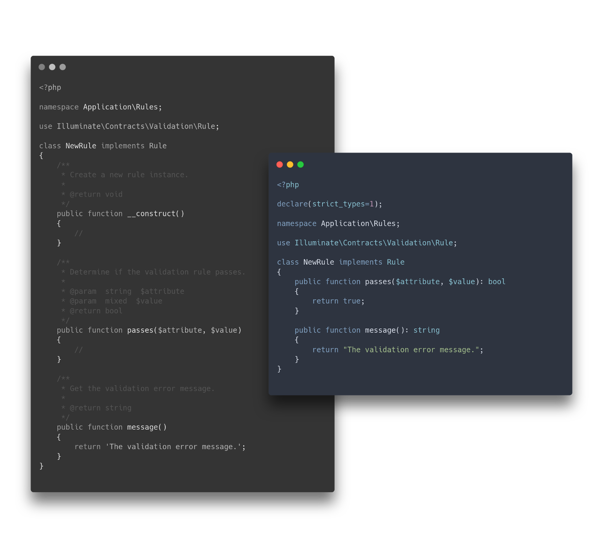

  

## blumilksoftware/stubs
Laravel stubs refactored and consistent with the Blumilk [codestyle](https://github.com/blumilksoftware/codestyle).


> `php artisan make:rule` before and after `blumilksoftware/stubs`

## Installation
Just run:
```
composer require blumilksoftware/stubs --dev
```

It should add `BlumilkStubsServiceProvider` to your application via automagic package discovery.

## Usage
There are two ways to use Blumilk stubs.

Default one creates a symbolic link in your application's main directory pointing to the vendor directory `./vendor/blumilksoftware/stubs`:
```
php artisan blumilk:stubs
```

Second one triggers copying of all stubs from vendor into your application's main directory:
```
php artisan blumilk:stubs --copy
```

After that any `php artisan make:whatever` will be using new stubs. 

### Development
Run tests:
```
dcr php composer test
```

Run codestyle check:
```
dcr php composer cs
```

Please maintain our project guidelines:
* keep Issues well described, labeled and in English,
* add issue number to all your commits,
* add issue number to your branch name,
* squash your commits into one commit with standardized name.

> `dcr` should be an alias to `docker-compose run --rm -u "$(id -u):$(id -g)"`.